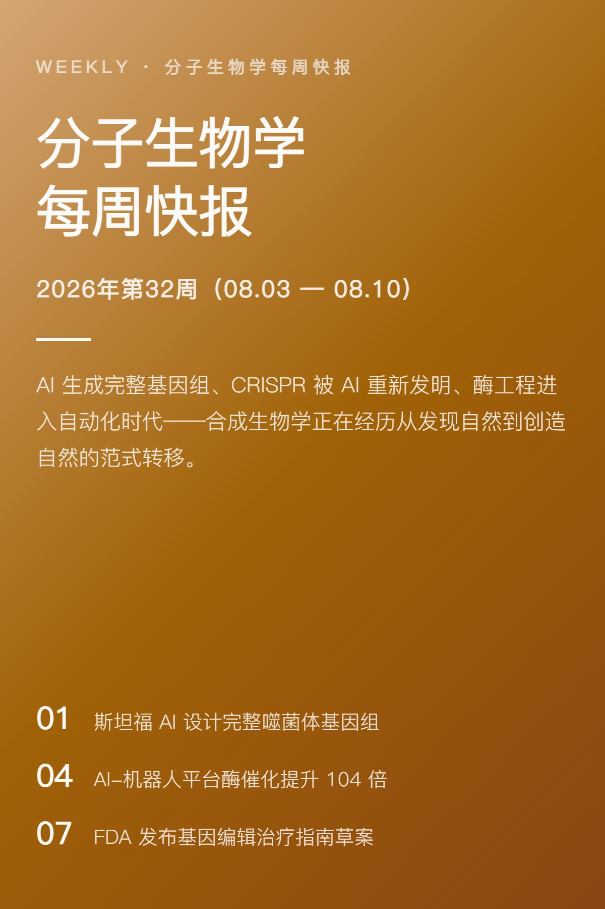
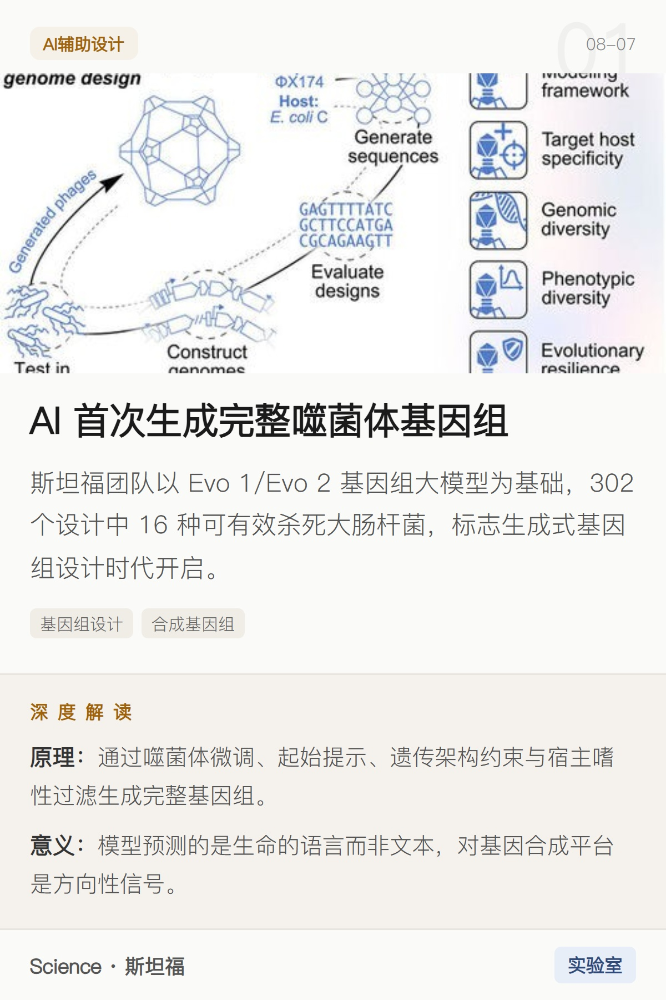
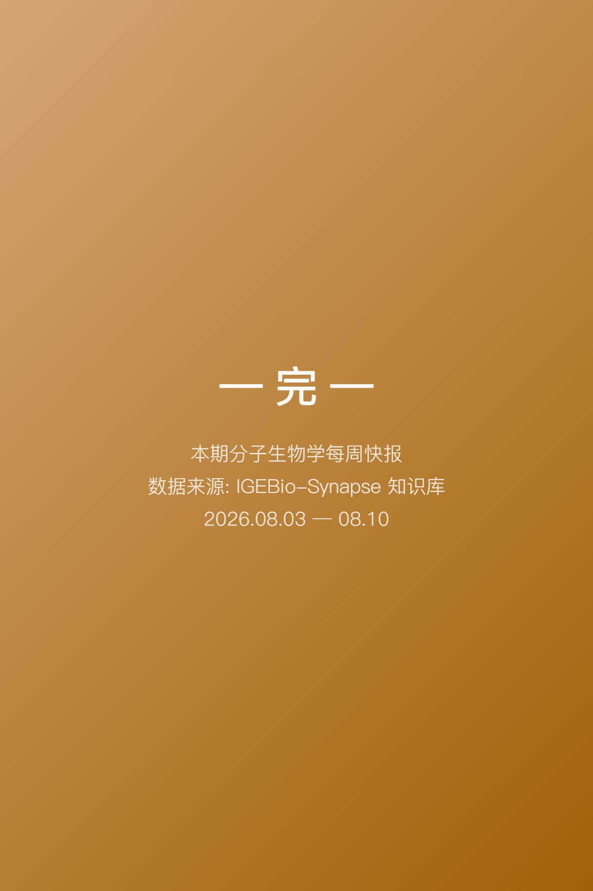

# social-media-news-cards

将已组装好的 HTML 卡片页面导出为独立 JPG 图片文件 — 3x Retina · Playwright 截图 · 小红书/公众号格式

> 本仓库是一个 **Hermes AI Agent Skill**，供 Hermes / Claude Code 等支持 skills 的 agent 加载使用。

* * *

## 简介

制作一期「每周新闻快报」风格的社交媒体卡片，通常需要：设计 HTML 卡片布局 → 为每条新闻搜集真实配图 → 处理图片防盗链 → 高清截图导出 → 验证输出。

social-media-news-cards 把这一整条链路固化为可复用的技能：**输入 JSON/Markdown 格式的卡片数据，输出 12 张可直接发布的 JPG 图片**，全程无需手动排版。

* * *

## 效果预览

以下截图来自实际生产案例——2026 年第 32 周合成生物学新闻快报，已完整导出。

| 区域 | 内容 |
|------|------|
| 封面 | 标题 + 周期 + 导读 + 3 条高亮 |
| 新闻卡片 | 编号/图片/标题/摘要/标签/深度解读/底部来源 |
| 末页 | 完 |

### 封面：标题、周期、导读与高亮

### 新闻卡片：真实配图与深度解读

### 末页

* * *

## 功能特性

### 高清输出

| 参数 | 值 |
|------|------|
| 尺寸 | 400×600px（竖版） |
| 分辨率 | 3x DPI（Retina，实际 1200×1800px） |
| 格式 | JPEG |
| 质量 | 95% |
| 文件大小 | 90KB ~ 430KB |

### 图片来源策略

| 优先级 | 来源 | 说明 |
|--------|------|------|
| 1 | 本地文件 | imgs/ 目录已有图片 |
| 2 | Tavily 搜索 | 精确搜索文章标题，include_images: true |
| 3 | 来源页提取 | 访问文章 URL 提取 og:image |

**不接受**：Unsplash、Pexels 等通用图库（图文无关）

### 设计规范（固定）

| 部分 | 内容 |
|------|------|
| 封面 | 标题 + 周期 + 导读 + 3 条高亮 |
| 新闻卡片 | 编号/图片/标题/摘要/标签/深度解读/底部来源 |
| 末页 | 完 |

### 字号层级（手机优先）

| 元素 | 字号 |
|------|------|
| 封面大标题 | 34-36px |
| 新闻标题 | 22px |
| 新闻摘要 | 14.5-15px |
| 深度解读 | 13.5px |
| 底部来源 | 12px |
| 标签 | 11px |

### 禁忌

- ❌ emoji
- ❌ SVG 占位图
- ❌ Unsplash 等通用图库
- ❌ "下期预告"
- ❌ 圆角（要直角）
- ❌ 深色模式（默认浅色）

### 可变参数

| 参数 | 说明 | 示例 |
|------|------|------|
| 封面配色 | 渐变起始/结束色 | #D4A574 → #A16207 |
| 标题文字 | 每期可能不同 | "分子生物学每周快报" |
| 导读文案 | 每周不同 | "AI 生成完整基因组..." |
| 高亮条目 | 3 条，每周不同 | ["新闻1", "新闻2", "新闻3"] |

* * *

## 使用方法

### 安装

将本目录放置到 agent 的 skills 目录（例如 Hermes 的 ~/.hermes/skills/creative/social-media-news-cards/）。

### 环境依赖

`ash
pip install playwright Pillow pyyaml
playwright install chromium
`

> 如果 Playwright Chromium 下载超时，可改用系统自带的 Edge 浏览器（SKILL 已内置路径）

### 触发

直接提供卡片数据并说明意图：

`
导出第32周的卡片
生成周报图片，第32周
`

* * *

## 目录结构

`
social-media-news-cards/
├── SKILL.md                          # 主流程 + 触发词 + 硬规范
├── README.md                         # 本说明
├── LICENSE                           # MIT 许可证
├── tutorial.md                       # 使用教程
├── references/
│   └── workflow.md                   # 工作流参考
└── screenshots/                      # 实际案例截图（用于 README 预览）
    ├── 01-cover.jpg                  # 封面
    ├── 02-news.jpg                   # 新闻卡片
    └── 03-end.jpg                    # 末页
`

* * *

## 版本记录

| 版本 | 说明 |
|------|------|
| v2.0.0 | 重构为通用 skill：移除 IGEBio 特定路径，输出目录泛化为 {标题}/{YYYY}年第{NN}周/ |

* * *

## 许可

MIT License

Copyright (c) 2026 flyanx

本技能基于实际社交媒体发布工作流沉淀，可自由 fork / 修改 / 复用。
